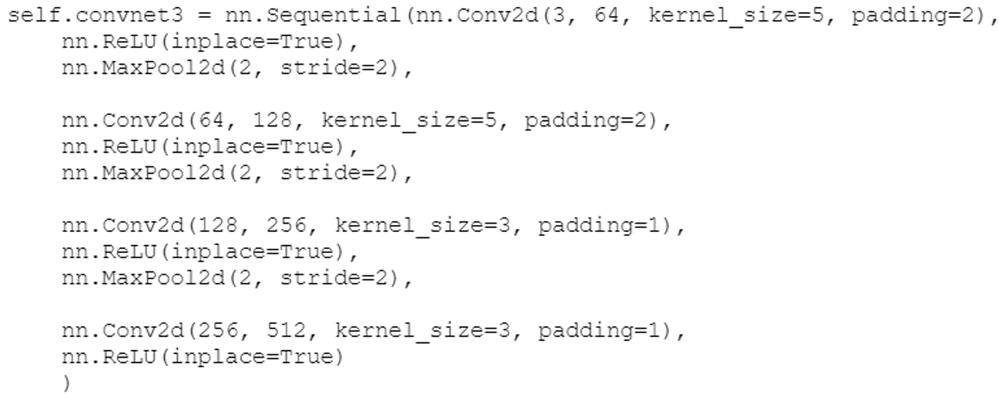

# MultiPatch Face Recognition

- [Description](#description)
- [Article](#article)
- [Objectives](#objectives)
- [Experiments](#experiments)
  - [Data Description](#data-description)
  - [Patchs](#patchs)
  - [Generating Triplets](#generating-triplets)
  - [The CNN architecture chosen ](#the-cnn-architecture-chosen)
- [Results](#results)
- [Conclusion](#conclusion)
- [Authors](#authors)
- [Note about this project](#note-about-this-project)

# Description
 In this project, our main objective is to implement the method that was implemented in the article [Targeting Ultimate Accuracy Face Recognition by Liu & al.](https://arxiv.org/ftp/arxiv/papers/1506/1506.07310.pdf). In addition to the implementation of the method, our goal is also to understand the specifics of the article since many details were left out.

# Article
[Targeting Ultimate Accuracy Face Recognition by Liu & al.](https://arxiv.org/ftp/arxiv/papers/1506/1506.07310.pdf) 
To start with the analysis of the article, the method develops two specific tools : the Triplet-Loss and the Multi-patch. 
The Multi-Patch is a method used for face recognition. The principle is simple, we do not only provide the whole face to the CNN input, but also some part of the face based on landmarks. For example, we can take at the same time as the face in input the eyes only or the mouth, as illustrated below. 
||
|:--:|
|*Overview of deep CNN structure on multi-patch*|
 

Then each part of the face thus selected passes through a network of nine CNNs. The result obtained in each CNN is then concatenated to have a single unidimensional vector at the output of the Multi-patch. 

The second step of the method was the implementation of the Triplet loss. Indeed, for face recognition there are several possible loss functions better than the classical Categorical-Crossentropy. The principle of the Siamese loss is simple, rather than giving in input to the neural network a single image, we give in input an image and another image of the same person that we will name positive image and the image with an image of another person that we will name negative image. The aim of the loss function is to reduce the distance between the anchor and the positive image and to increase the distance between the anchor and the negative image.  
||
|:--:|
|[Triplet Loss (Source: Facenet)](https://arxiv.org/pdf/1503.03832.pdf)|
 
Unlike Siamese, the Triplet loss, as its name indicates, takes three images as input, the anchor, the positive image and the negative image. The principle of Triplet loss is to have a distance between the anchor and the negative image greater than the distance between the anchor and the positive image plus a margin. The margin is there to compensate for images of the same person but with a different brightness or an older age. 
The Triplet loss thus takes in input three images with their patches, put them in input of three neural networks with shared weights as represented on the figure below.

||
|:--:|
|[Triplet Loss (Source: Wikimedia)](https://commons.wikimedia.org/wiki/File:Triplet_loss.png)|

# Objectives
Once we understood the article, we had to set goals, we chose three realistic ones for this project
The first one was to implement the main ideas behind the paper “Targeting Ultimate Accuracy: Face Recognition via Deep Embedding” by Liu & al. which are the use of multiple patches and triplet loss. 
The second objective was to study the impact of increasing the number of patches. In the original paper, two conclusions were made : increasing the number of patches increases the accuracy and after 7 patches the accuracy converges.  
Thirdly, comparing triplet loss to Siamese loss for the specific case of multiple patches network. Even though conclusions were made for single images, we were curious as to how the accuracy would evolve when increasing the number of patches and using two different losses.

# Experiments 

## Data Description
To deal with this subject, we have chosen to use the LFW database. On the one hand because it is the same database as the one used in the article, so it had the advantage of allowing us to compare our results with those realized in the article, on the other hand because the database has many advantages. First, by choosing to take the image of people having at least 10 different, we manage to have 4324 images. The images of the same person, as we can see below, have the advantage of having a good global luminosity and different luminosity. The images also have the advantage of being in different positions, with no or little occlusion and different facial expressions.
||
|:--:|
|Example of images of the same person from the LFW dataset|

## Patchs
Once we had managed to appropriate the database, we had to start by implementing the Multi-patch. To do this we had to decide which parts of the face we were going to use for our patches because the article mentions landmarks but does not mention them explicitly. To start we used the Open-CV library which allows us to position on a face 68 markers representing regions of the face. 
||
|:--:|
|All 68 face landmarks, done with the haarcascade face landmark algorithm of dlib|
 
Once we had the markers, we were able to put the patches in place to have a maximum of 7. 
||
|:--:|
|The first method to obtain Multi-patchs|
 
However, we could not be satisfied with this first approach. The reason is simple: the patches were not all the same size. So we had to standardize the size of the different patches by taking as reference the training set. The principle was very simple, we would go through all the training set to find for each patch the biggest height and the biggest width to be sure that for all the images contain the region of the chosen face. Then we took the center of each rectangle of the first method as the center of the new rectangle, and we obtain the patches below.
||
|:--:|
|The final method to obtain Multi-patchs|
 
However, there is a drawback to this approach. For the faces where one of the parts is at the edge of the image, in order to have images of the same size for the CNN, we had to shift the center of the rectangle. So in very rare cases, we had patches that did not contain only the desired region.

## Generating Triplets
Once we had our patches, we started to make our triplet for our CNN. We grouped as agreed an anchor, a positive image and a negative image.
||
|:--:|
|Examples of triplets of patchs|

## The CNN architecture chosen 
Now that the pre-processing of the data is done and that we have it in the desired format, it was time to realize the neural networks. We first tried to implement as in the article a neural network containing nine CNN layers at first but then decreased that number to four.
||
|:--:|
|CNN architecture|

# Results

||
|:--:|

||
|:--:|

# Conclusion
In this project, we propose a personal implementation of the article [Targeting Ultimate Accuracy Face Recognition by Liu & al.](https://arxiv.org/ftp/arxiv/papers/1506/1506.07310.pdf). 

After our experiments, we can conclude that the more patchs are used, the greater the results. Also, just as it can be seen in normal methods (without multipatch), this method also performs much better with triplet loss than with siamese loss.

# Authors
Steve SUARD, Student at Telecom SudParis, Institut Polytechnique de Paris. 
[Saad LAHLALI](https://www.linkedin.com/in/saad-lahlali/), Student at Telecom SudParis, Institut Polytechnique de Paris.

# Note about this project
This work was done for a school project in first year of master.
